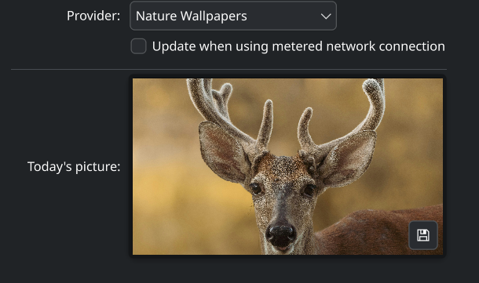

# KDE Plasma Nature Wallpapers

A Picture of the Day provider for KDE Plasma 6 that displays beautiful nature wallpapers on a daily rotation.

[](https://github.com/blueheron786/potd-nature-wallpapers-plasma/actions/workflows/ci.yml)
[](https://opensource.org/licenses/MIT)
[](https://kde.org/plasma-desktop/)
[](https://www.qt.io/)



## Overview

This KDE Plasma 6 Picture of the Day (PoTD) provider automatically sets your desktop wallpaper to a different nature photograph each day. The provider fetches images from a curated collection hosted on GitHub Pages, cycling through the collection based on the current date.

## Features

- **Daily Rotation**: Automatically updates your wallpaper each day
- **Nature Photography**: Curated collection of beautiful nature images
- **Date-Based Selection**: Wallpapers are selected based on days since a fixed epoch (2026-01-01)
- **Robust Error Handling**: Gracefully handles network failures, missing images, and invalid data
- **KDE Plasma 6 Integration**: Built using modern KDE Frameworks 6 and Qt 6
- **Asynchronous Operation**: Uses KIO for non-blocking network operations
- **Proper Attribution**: Includes photographer credit information (extensible)

## How It Works

The provider determines which wallpaper to display by:

1. Using 2026-01-01 as the epoch (day 0)
2. Calculating the number of days between the epoch and the requested date
3. Using modulo arithmetic to map this to an index in the wallpaper collection
4. Fetching the corresponding image from `https://blueheron786.github.io/potd-nature-wallpapers-plasma/wallpapers/`

The formula is: `wallpaper_number = ((days_since_epoch % total_wallpapers) + total_wallpapers) % total_wallpapers + 1`

This ensures:
- Dates before the epoch wrap correctly (e.g., 2025-12-31 shows the last wallpaper)
- Leap years are handled naturally by the QDate calculation
- The sequence repeats when we run out of wallpapers
- The mapping is deterministic and consistent

## Installation

### From Source

1. **Dependencies**: You need KDE Frameworks 6, Qt 6, and the Plasma PoTD development packages:
   ```bash
   # On Fedora:
   sudo dnf install extra-cmake-modules qt6-qtbase-devel kf6-kcoreaddons-devel kf6-kio-devel plasma-workspace-devel

   # On Ubuntu 24.04+:
   sudo apt install extra-cmake-modules qt6-base-dev libkf6coreaddons-dev libkf6kio-dev plasma-workspace-dev
   ```

2. **Build and Install**:
   ```bash
   git clone https://github.com/blueheron786/potd-nature-wallpapers-plasma.git
   cd potd-nature-wallpapers-plasma
   mkdir build && cd build
   cmake -DCMAKE_BUILD_TYPE=Release ..
   cmake --build .
   sudo cmake --install .
   ```

3. **Enable the Provider**:
   - Log out and back in, or run: `systemctl --user restart plasma-plasmashell.service`
   - Go to System Settings → Wallpaper → Picture of the Day
   - Select "Nature Wallpapers" from the list

### Usage

Once installed, the provider will automatically update your wallpaper daily. You can manually trigger an update by:
1. Right-clicking on your desktop
2. Selecting "Configure Desktop and Wallpaper"
3. Going to the "Picture of the Day" tab
4. Clicking the "Apply" button

## Configuration

The provider has no user-configurable options. It is designed to be simple and predictable:
- Uses a fixed epoch date (2026-01-01)
- Retrieves wallpapers from the predefined GitHub Pages URL
- Displays wallpapers in a deterministic sequence based on the date

## Wallpaper Collection

The wallpaper collection consists of JPEG images named sequentially:
- `wallpapers/wallpaper_001.jpg`
- `wallpapers/wallpaper_002.jpg`
- `wallpapers/wallpaper_003.jpg`
- etc.

**Important**: Wallpaper selection and curation is handled separately. This repository only contains the provider software. To use this provider, you need to have the wallpaper images deployed to the GitHub Pages site at the specified URL.

## Extending the Collection

To add more wallpapers:
1. Name your images sequentially: `wallpaper_001.jpg`, `wallpaper_002.jpg`, etc.
2. Ensure all images are deployed to `https://blueheron786.github.io/potd-nature-wallpapers-plasma/wallpapers/`
3. Update the `DefaultWallpaperCount` constant in `src/natureprovider.cpp` to match the total number of images
4. Rebuild and reinstall the provider

## Attribution and Licensing

The nature wallpapers in this collection are sourced from Unsplash photographers. Each image should be properly attributed according to the Unsplash license.

While the provider framework supports extensible attribution metadata (via a planned manifest format), the current implementation focuses on reliable wallpaper delivery. Future versions may include:
- Photographer name display
- Source URL linking
- License information

Please respect the licenses of individual wallpaper images when using this provider.

## Development

### Building with Tests

```bash
mkdir build && cd build
cmake -DCMAKE_BUILD_TYPE=Debug -DBUILD_TESTING=ON ..
cmake --build .
ctest --output-on-failure  # Run unit tests
```

### Code Structure

- `src/natureprovider.h/.cpp`: Main provider implementation
- `src/natureprovider.json`: Plugin metadata
- `src/CMakeLists.txt`: Build configuration
- `tests/`: Unit tests for core logic
- `.github/workflows/`: CI/CD pipeline

### Contributing

We welcome contributions! Please:

1. Fork the repository
2. Create a feature branch (`git checkout -b feature/amazing-feature`)
3. Commit your changes (`git commit -m 'Add amazing feature'`)
4. Push to the branch (`git push origin feature/amazing-feature`)
5. Open a Pull Request

Please ensure your code follows:
- KDE coding standards
- Proper error handling and logging
- Unit tests for new logic
- Clear commit messages

## Support

If you encounter issues or have questions:
1. Check the [issue tracker](https://github.com/blueheron786/potd-nature-wallpapers-plasma/issues)
2. Create a new issue with detailed information
3. Include relevant logs and system information

## Acknowledgments

- **KDE Community**: For providing the excellent Plasma framework and development tools
- **Unsplash Photographers**: For sharing their stunning nature photography
- **Qt Framework**: For the robust cross-platform application framework

## License

This software is released under the MIT License. See the [LICENSE](LICENSE) file for details.

Wallpaper images remain the property of their respective photographers and are subject to their individual licenses.

---

*Note: This provider does not include the actual wallpaper images due to repository size constraints. The images must be separately deployed to the GitHub Pages site for the provider to function correctly.*